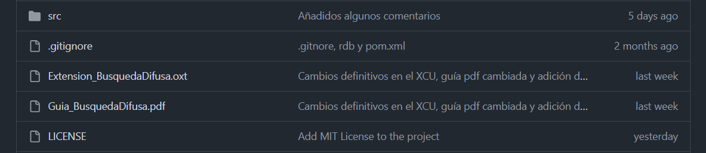
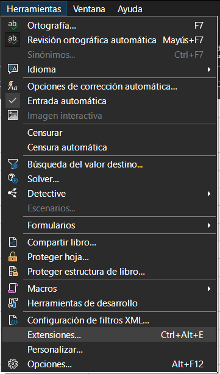
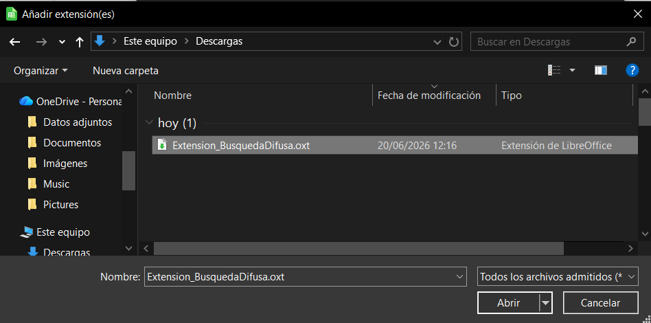
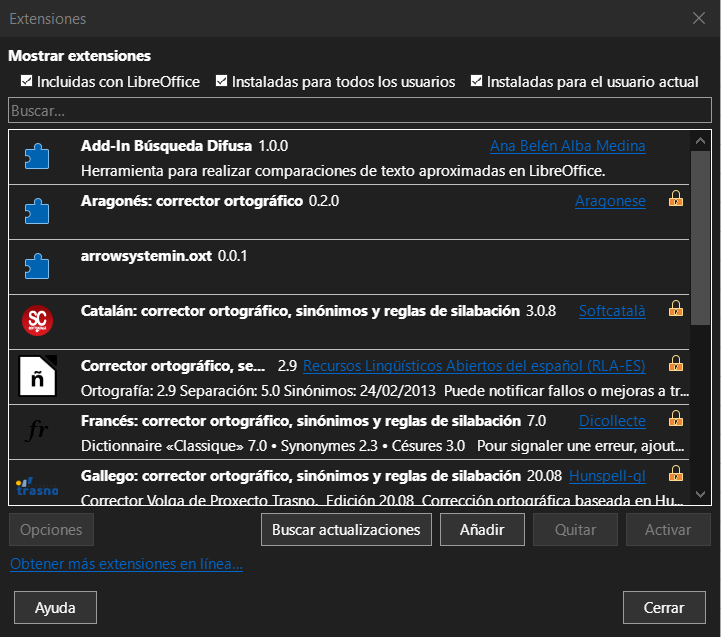

# Desarrollo de una extensión para la comparación aproximada de cadenas de texto en hojas de cálculo

## 📌 Descripción

Este proyecto consiste en el desarrollo de una extensión para la hoja de cálculo Calc de la suite ofimática LibreOffice, que permite realizar comparación aproximada de cadenas de texto.

A diferencia de la comparación exacta que ofrece Calc por defecto, esta extensión permite calcular el grado de similitud entre dos cadenas mediante un valor normalizado entre 0 y 1, facilitando el análisis de datos que pueden contener errores tipográficos o variaciones en el texto.

La extensión implementa tres métodos de comparación:

- **Distancia de Levenshtein**: calcula las modificaciones necesarias para transformar una cadena en otra.
- **Comparación mediante n-gramas**: analiza la cantidad de fragmentos coincidentes entre dos cadenas.
- **Método combinado**: obtiene una medida de similitud basada en ambos enfoques.

El proyecto ha sido desarrollado en Java utilizando las herramientas proporcionadas por LibreOffice para la creación de extensiones.

## 🛠️ Tecnologías utilizadas

- Java
- LibreOffice Calc
- LibreOffice SDK
- Maven

## 📦 Instalación

### 1. Descargar la extensión

Descargue el archivo de instalación desde la sección de versiones del repositorio:

**Extension_BusquedaDifusa.oxt**

### 2. Instalar la extensión

1. Abra LibreOffice Calc.
2. Seleccione **Herramientas → Extensiones** en la barra de menús.
3. En la ventana del gestor de extensiones, pulse **Añadir**.
4. Seleccione el archivo **Extension_BusquedaDifusa.oxt** descargado previamente.
5. Reinicie LibreOffice Calc para que los cambios surtan efecto.

#### Acceso al gestor de extensiones

#### Selección del archivo de instalación

#### Extensión instalada correctamente

## 🚀 Uso

Ver guía **Guía_BusquedaDifusa.pdf**.

## 📄 Licencia

Este proyecto se distribuye bajo licencia MIT.
